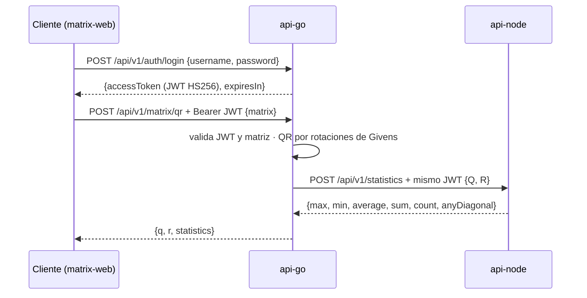

# api-go · Factorización QR

API REST en **Go 1.27 + Fiber v3** que recibe una matriz rectangular, calcula su **factorización QR completa por
rotaciones de Givens** y envía Q y R a **api-node** (repositorio propio), que devuelve estadísticas.
Emite los **JWT** que protegen todo el sistema.

Es un **servicio autónomo**: se construye, prueba y despliega por separado. Su único acoplamiento con api-node es
HTTP (`NODE_API_URL`), según el contrato que api-node publica
([ADR-001](docs/architecture/ADR-001-servicios-independientes.md), [ADR-002](docs/architecture/ADR-002-decisiones-tecnicas.md)).

## Contenido
- [Cómo funciona](#cómo-funciona)
- [Requisitos](#requisitos)
- [Inicio rápido](#inicio-rápido)
- [Uso de la API](#uso-de-la-api)
- [Configuración](#configuración)
- [Arquitectura y estructura](#arquitectura-y-estructura)
- [Health check](#health-check)
- [Pruebas: cómo lanzarlas](#pruebas-cómo-lanzarlas)
- [SDD: especificaciones](#sdd-especificaciones)
- [Docker](#docker)
- [Despliegue en AWS](#despliegue-en-aws)
- [Integración continua](#integración-continua)
- [Problemas frecuentes](#problemas-frecuentes)
- [Reglas de contribución](#reglas-de-contribución)

---

## Cómo funciona



**Algoritmo:** por cada columna, de abajo hacia arriba, anula `R[i][j]` rotando el par de filas `(i−1, i)` con
`c = x/r`, `s = y/r`, `r = hypot(x, y)`, y acumula la misma rotación en Qᵀ. El resultado es Q (m×m) ortogonal y
R (m×n) triangular superior con diagonal ≥ 0. Funciona con matrices altas (m > n) y anchas (m < n). Por qué Givens:
[ADR-002 §1](docs/architecture/ADR-002-decisiones-tecnicas.md).

## Requisitos
- **Go 1.27+** para ejecutar localmente, o solo **Docker**.
- **api-node** accesible para `POST /api/v1/matrix/qr` (el login y `/health` funcionan sin él).

## Inicio rápido

```bash
cp .env.example .env          # define JWT_SECRET (el MISMO que en api-node)
```
> **El secreto debe coincidir.** `JWT_SECRET`, `JWT_ISSUER` y `JWT_AUDIENCE` tienen que ser iguales en los `.env` de
> api-go y api-node; si no, api-node rechaza el token y api-go responde `502 STATISTICS_UNAVAILABLE`.
> Genera uno con `openssl rand -base64 48`.

| Opción | Comando | Nota |
|---|---|---|
| **Docker** (recomendada) | `docker compose up --build` | Llega a api-node en `http://host.docker.internal:3000`; otro destino con `DOCKER_NODE_API_URL=...` |
| **Local** | `go run ./cmd/api` | Carga `.env` automáticamente; las variables del entorno tienen prioridad |

| URL | Qué es |
|---|---|
| http://localhost:8080/health | Estado del servicio |
| http://localhost:8080/docs | Referencia interactiva (Scalar) |
| http://localhost:8080/openapi.yaml | Contrato OpenAPI 3.1 ([`api/openapi.yaml`](api/openapi.yaml)) |

## Uso de la API

| Método | Ruta | Auth | Descripción |
|---|---|---|---|
| GET | `/health` | — | Estado del servicio |
| GET | `/docs` · `/openapi.yaml` | — | Documentación |
| POST | `/api/v1/auth/login` | — | Emite un JWT para el usuario de demo |
| POST | `/api/v1/matrix/qr` | JWT | QR de la matriz y estadísticas de Q y R |

```bash
# 1. Token (credenciales de demo del .env)
TOKEN=$(curl -s -X POST http://localhost:8080/api/v1/auth/login \
  -H 'Content-Type: application/json' \
  -d '{"username":"admin","password":"admin123"}' | jq -r .accessToken)

# 2. Factorización (requiere api-node levantado)
curl -s -X POST http://localhost:8080/api/v1/matrix/qr \
  -H "Authorization: Bearer $TOKEN" -H 'Content-Type: application/json' \
  -d '{"matrix":[[12,-51,4],[6,167,-68],[-4,24,-41]]}'
```

Respuesta (valores redondeados):
```json
{
  "q": [[0.857, -0.394, -0.331], [0.429, 0.903, 0.034], [-0.286, 0.171, -0.943]],
  "r": [[14, 21, -14], [0, 175, -70], [0, 0, 35]],
  "statistics": {
    "max": 175, "min": -70, "average": 8.969, "sum": 161.44, "count": 18,
    "anyDiagonal": false,
    "matrices": [{ "name": "Q", "isDiagonal": false }, { "name": "R", "isDiagonal": false }]
  }
}
```

### Errores
Todas las respuestas de error usan `{"error": {"code": "...", "message": "..."}}`.

| HTTP | `code` | Cuándo |
|---|---|---|
| 400 | `INVALID_REQUEST` | JSON mal formado o tipos inválidos |
| 400 | `INVALID_MATRIX` | Matriz vacía, no rectangular, con valores no finitos o mayor que `MATRIX_MAX_DIMENSION` |
| 401 | `UNAUTHORIZED` | Token ausente, inválido o expirado |
| 401 | `INVALID_CREDENTIALS` | Login con usuario o contraseña incorrectos |
| 404 | `NOT_FOUND` | Ruta inexistente |
| 502 | `STATISTICS_UNAVAILABLE` | api-node caído o respondió con error |
| 504 | `STATISTICS_TIMEOUT` | api-node no respondió en `NODE_API_TIMEOUT_MS` |

## Configuración

| Variable | Default | Descripción |
|---|---|---|
| `PORT` | 8080 | Puerto HTTP |
| `NODE_API_URL` | http://localhost:3000 | URL base de api-node |
| `NODE_API_TIMEOUT_MS` | 5000 | Timeout de llamadas a api-node |
| `JWT_SECRET` | — **obligatoria** (≥ 32) | Secreto HS256, igual al de api-node |
| `JWT_ISSUER` | api-go | Claim `iss` de los tokens |
| `JWT_AUDIENCE` | matrix-services | Claim `aud` de los tokens |
| `JWT_TTL_MINUTES` | 60 | Vigencia del token |
| `AUTH_USERNAME` | — **obligatoria** | Usuario de demo |
| `AUTH_PASSWORD` | — **obligatoria** | Contraseña de demo |
| `CORS_ALLOWED_ORIGINS` | http://localhost:4200 | Orígenes permitidos (frontend), separados por coma |
| `MATRIX_MAX_DIMENSION` | 100 | Máximo de filas y columnas |
| `DOCKER_NODE_API_URL` | http://host.docker.internal:3000 | Solo `docker compose`: reemplaza `NODE_API_URL` dentro del contenedor |

Si falta una variable obligatoria o alguna es inválida, el servicio **no arranca** y lista todos los problemas juntos.

## Arquitectura y estructura

Clean Architecture: las dependencias apuntan hacia el dominio.

```
api-go/
├── cmd/api/                 Punto de entrada: config, cliente de api-node, arranque y apagado ordenado
├── api/                     openapi.yaml + docs.html (Scalar), embebidos en el binario (go:embed)
├── internal/
│   ├── domain/              Núcleo puro: Matrix, Validate, QRGivens
│   ├── service/             Casos de uso (MatrixService, AuthService) y puertos (ports.go)
│   ├── client/              Adaptador HTTP hacia api-node (implementa StatisticsClient)
│   ├── auth/                JWTManager (HS256) y transporte del token en context.Context
│   ├── model/               DTOs de entrada y salida y formato de error
│   ├── handler/             Handlers HTTP: DTO → caso de uso → DTO
│   ├── middleware/          RequireJWT y ErrorHandler (único mapeo de error a HTTP)
│   ├── config/              Carga y validación de variables de entorno
│   └── server/              Raíz de composición: dependencias, middlewares y rutas
├── test/integration/        App completa + cliente real contra un api-node simulado
├── deploy/aws/              service.yml, platform.yml y scripts de despliegue (deploy, outputs, destroy)
├── specs/                   Especificaciones SDD por funcionalidad (Spec Kit)
├── .specify/                Constitución y plantillas de Spec Kit
├── docs/                    ADRs y guía de despliegue en AWS
├── .github/workflows/       CI (pruebas + build, sin despliegues)
├── Dockerfile               Multi-stage → distroless, usuario no root
└── docker-compose.yml       Ejecución aislada
```

| Patrón | Dónde |
|---|---|
| Service Layer | `internal/service`: casos de uso sin HTTP |
| Dominio puro | `internal/domain`: matemática testeable sin dependencias |
| DTOs | `internal/model` |
| Puertos y adaptadores | `StatisticsClient` y `TokenIssuer` (interfaces) ← `client`, `auth` |
| Middleware | `recover` → `requestid` → `logger` → CORS → `helmet` → `RequireJWT` → `ErrorHandler` |

## Health check
| Nivel | Qué verifica | Dónde |
|---|---|---|
| Endpoint | `GET /health` → `{"status":"ok","service":"api-go"}` (público, sin JWT) | `internal/server/server.go` |
| Balanceador de AWS | El target group consulta `/health` cada 15 s; 3 fallos sacan la tarea del tráfico | `deploy/aws/service.yml` |
| Despliegue | Si las tareas nuevas no pasan el health check, ECS vuelve a la versión anterior (circuit breaker) | `deploy/aws/service.yml` |
| Frontend | matrix-web sondea `/health` y muestra estado y latencia | repositorio matrix-web |

> La imagen es *distroless* (sin shell), por eso no tiene `HEALTHCHECK` de Docker: la salud la verifica el balanceador.

## Pruebas: cómo lanzarlas
| Qué quieres | Comando |
|---|---|
| Todas las pruebas | `go test ./...` |
| Solo unitarias | `go test ./internal/... ./cmd/...` |
| Solo integración | `go test ./test/integration/...` |
| Un paquete o una prueba concreta | `go test ./internal/domain/ -run TestQRGivensProperties -v` |
| Con detector de condiciones de carrera (como el CI) | `go test -race ./...` |
| Cobertura total (~97 %) | `go test -coverpkg=./internal/... -coverprofile=c.out ./... && go tool cover -func=c.out` |
| Reporte HTML de cobertura | `go tool cover -html=c.out` |
| Formato y análisis estático | `gofmt -l . && go vet ./...` |
La factorización se verifica por propiedades (Q·R ≈ A, QᵀQ ≈ I, R triangular, diagonal ≥ 0, entrada no mutada)
en matrices cuadradas, altas, anchas, singulares y con valores del orden de 1e150, además de un resultado conocido.

> **Windows con Smart App Control:** si se bloquea un `*.test.exe`, corre las pruebas en contenedor:
> `docker run --rm -v "${PWD}:/src" -w /src golang:1.27-alpine go test ./...`

## SDD: especificaciones
Esta primera versión se desarrolló con **Spec-Driven Development** usando [Spec Kit](https://github.com/github/spec-kit):
primero la especificación, luego el plan, las tareas y la implementación guiada por pruebas.

- **Constitución** (principios que todo plan debe cumplir): [`.specify/memory/constitution.md`](.specify/memory/constitution.md)
- **Especificaciones** (una carpeta por funcionalidad, cada una con `spec.md`, `plan.md`, `research.md`,
  `data-model.md`, `contracts/`, `quickstart.md`, `tasks.md` y `checklists/`):

| Spec | Funcionalidad | Historias |
|---|---|---|
| [`001-autenticacion-jwt`](specs/001-autenticacion-jwt/spec.md) | Login, protección de rutas y propagación del JWT a api-node | 3 (P1, P1, P2) |
| [`002-factorizacion-qr`](specs/002-factorizacion-qr/spec.md) | QR por Givens, validación de entrada e integración con api-node | 3 (P1, P1, P2) |

Flujo para una funcionalidad nueva (desde Claude Code en este repositorio):
`/speckit-specify` → `/speckit-clarify` → `/speckit-plan` → `/speckit-tasks` → `/speckit-implement`.

## Docker
- **Imagen:** multi-stage. Compila un binario estático (`CGO_ENABLED=0`) y lo copia a `distroless/static:nonroot`
  (≈ 21 MB, sin shell, usuario no root). El contrato y la página de Scalar van embebidos.
- `docker compose up --build` levanta el servicio solo; lee `.env` y publica `${PORT:-8080}`.

## Despliegue en AWS
Se despliega en **ECS Fargate** detrás del ALB compartido, en el puerto **8080**
([guía completa](docs/deploy/aws.md), [ADR-004](docs/architecture/ADR-004-despliegue-aws.md)).

```bash
# Crea la plataforma compartida (red, ALB, clúster, secretos) si aún no existe; luego despliega este servicio
./deploy/aws/deploy.sh
./deploy/aws/outputs.sh                                       # URLs y contraseña de demo
PARAM_OVERRIDES="DesiredCount=2 Cpu=512 Memory=1024" ./deploy/aws/deploy.sh   # con parámetros
```
En AWS, `JWT_SECRET` y `AUTH_PASSWORD` vienen de **Secrets Manager**, y `NODE_API_URL` y `CORS_ALLOWED_ORIGINS` se
calculan a partir del ALB. Parámetros de [`deploy/aws/service.yml`](deploy/aws/service.yml): `Cpu`, `Memory`,
`DesiredCount`, `NodeApiUrl`, `AuthUsername`, `JwtTtlMinutes` y `MatrixMaxDimension`.

**¿Usas ECS Express Mode desde la consola?** Usa `./deploy/aws/express-deploy.sh` (configura puerto, health check, variables y secretos, y tiene un modo `diagnose`) y consulta [docs/deploy/aws-express.md](docs/deploy/aws-express.md).

**Costo y limpieza.** Los tres servicios comparten un solo balanceador y usan Fargate Spot: ≈ US$ 45 al mes si quedan
encendidos 24/7 y centavos para una demo de horas ([detalle](docs/deploy/aws.md#4-costos-estimados)). Pausar:
`PARAM_OVERRIDES="DesiredCount=0" ./deploy/aws/deploy.sh`. Eliminar: `CONFIRM=si ./deploy/aws/destroy.sh` (agrega
`DESTROY_PLATFORM=si` en el último servicio para borrar también la plataforma).

## Integración continua
[`.github/workflows/ci.yml`](.github/workflows/ci.yml): un solo job que corre formato → `go vet` → pruebas unitarias → integración → build de la imagen Docker (sin publicarla).
Pensado para costo mínimo: ignora cambios solo de documentación, cancela ejecuciones repetidas de la misma rama y
**no despliega ni usa servicios de AWS** (el despliegue es manual con `./deploy/aws/deploy.sh`).

## Problemas frecuentes
| Síntoma | Causa y solución |
|---|---|
| `configuración inválida: JWT_SECRET es obligatorio...` | Falta `.env` o el secreto tiene menos de 32 caracteres |
| `502 STATISTICS_UNAVAILABLE` | api-node no está levantado, o `JWT_SECRET`/`JWT_ISSUER`/`JWT_AUDIENCE` no coinciden |
| `502` solo en Docker | Dentro del contenedor, `localhost` es el propio api-go: usa `DOCKER_NODE_API_URL` o publica api-node en `:3000` |
| El navegador bloquea por CORS | Agrega el origen del frontend a `CORS_ALLOWED_ORIGINS` |
| `An Application Control policy has blocked this file` | Smart App Control de Windows: corre las pruebas en contenedor (ver [Pruebas](#pruebas)) |

## Reglas de contribución
Todo cambio debe incluir, en el mismo commit o PR:
1. **Pruebas** unitarias nuevas o actualizadas (e integración si cambia un endpoint).
2. **Documentación** al día: GoDoc, este README, `.claude/CLAUDE.md` y `api/openapi.yaml` si cambia la API.
3. **Docker y despliegue** actualizados si cambian dependencias, variables de entorno, puertos o el build
   (`Dockerfile`, `docker-compose.yml`, `.env.example`, `.dockerignore` y `deploy/aws/service.yml`).
